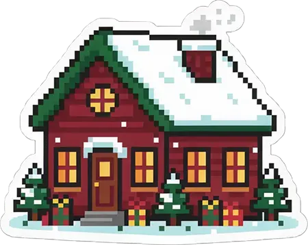
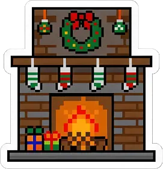
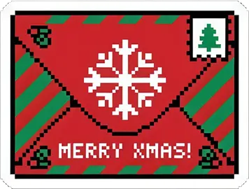

  

# What is this repo?

This is a repo where I will upload my solutions for [https://adventjs.com/](https://adventjs.com/).
I encourage you to try to solve them yourself, and if you have any questions, you can check if I've solved the problem!

I will be exclusively using git to upload my answers, so I'm able to learn and improve my git skills/commands.

I will try to keep up with JS, TS and Python at the same time.

# NOTE:

Some of the files include comments. Using comments might get your Code Review score down. Remember to remove them before entering the solution.

|  #  |                                                                                              Riddle                                                                                               |                Solution                 |                Difficulty                 |  |  |  |
| :-: | :-----------------------------------------------------------------------------------------------------------------------------------------------------------------------------------------------: | :-------------------------------------: | :---------------------------------------: | :-------------------------------------------------------: | :-------------------------------------------------------: | :-------------------------------------------------------: |
|  1  | 
<a href="https://adventjs.dev/challenges/2025/1"> 🎁 Filter the defective gifts</a>
  | 
[View](day1)
  | 🟢 Easy | Code Review: **5/5** Stars: **8/8** | Code Review: **5/5** Stars: **8/8** | Code Review: **5/5** Stars: **8/8** |
|  2  | 
<a href="https://adventjs.dev/challenges/2025/2"> 🏭 Manufacture the Toys</a>
 | 
[View](day2)
  | 🟢 Easy | Code Review: **5/5** Stars: **8/8** | Code Review: **5/5** Stars: **8/8** | Code Review: **5/5** Stars: **8/8** |
|  3  | 
<a href="https://adventjs.dev/challenges/2025/3"> 👶 Help the intern</a>
 | 
[View](day3)
  | 🟢 Easy | Code Review: **5/5** Stars: **8/8** | Code Review: **5/5** Stars: **8/8** | Code Review: **5/5** Stars: **8/8** |
|  4  | 
<a href="https://adventjs.dev/challenges/2025/4"> 🧮 Decipher the Santa PIN</a>
  | 
[View](day4)
  | 🟡 Medium | Code Review: **5/5** Stars: **8/8** | Code Review: **5/5** Stars: **8/8** | Code Review: **5/5** Stars: **8/8** |
|  5  | 
<a href="https://adventjs.dev/challenges/2025/5"> ⏱️ The countdown to take off</a>
 | 
[View](day5)
  | 🟢 Easy | Code Review: **5/5** Stars: **8/8** | Code Review: **5/5** Stars: **8/8** | Code Review: **5/5** Stars: **8/8** |
|  6  | 
<a href="https://adventjs.dev/challenges/2025/6"> 🧤 Matching gloves</a>
 | 
[View](day6)
  | 🟢 Easy | Code Review: **5/5** Stars: **8/8** | Code Review: **5/5** Stars: **8/8** | Code Review: **5/5** Stars: **8/8** |
|  7  | 
<a href="https://adventjs.dev/challenges/2025/7"> 🎄 Decorating the tree</a>
 | 
[View](day7)
  | 🟢 Easy | Code Review: **5/5** Stars: **8/8** | Code Review: **5/5** Stars: **8/8** | Code Review: **5/5** Stars: **8/8** |
|  8  | 
<a href="https://adventjs.dev/challenges/2025/8"> 🎁 Find the unique toy</a>
 | 
[View](day8)
  | 🟢 Easy | Code Review: **5/5** Stars: **8/8** | Code Review: **5/5** Stars: **8/8** | Code Review: **5/5** Stars: **8/8** |
|  9  | 
<a href="https://adventjs.dev/challenges/2025/9"> 🦌 The reno robot aspirator</a>
 | 
[View](day9)
  | 🔴 Hard | Code Review: **5/5** Stars: **8/8** | Code Review: **5/5** Stars: **8/8** | Code Review: **5/5** Stars: **8/8** |
| 10  | 
<a href="https://adventjs.dev/challenges/2025/10"> 📨 Depth of Christmas magic</a>
 | 
[View](day10)
 | 🟢 Easy | Code Review: **5/5** Stars: **8/8** | Code Review: **5/5** Stars: **8/8** | Code Review: **5/5** Stars: **8/8** |
| 11  | 
<a href="https://adventjs.dev/challenges/2025/11"> 📹 Unwatched gifts</a>
 | 
[View](day11)
 | 🟢 Easy | Code Review: **5/5** Stars: **8/8** | Code Review: **5/5** Stars: **8/8** | Code Review: **5/5** Stars: **8/8** |
| 12  | 
<a href="https://adventjs.dev/challenges/2025/12"> ⚔️ Elf battle</a>
 | 
[View](day12)
 | 🟡 Medium | Code Review: **5/5** Stars: **8/8** | Code Review: **5/5** Stars: **8/8** | Code Review: **5/5** Stars: **8/8** |
| 13  | 
<a href="https://adventjs.dev/challenges/2025/13"> 🏭 The assembly line</a>
 | 
[View](day13)
 | 🟡 Medium | Code Review: **5/5** Stars: **8/8** | Code Review: **5/5** Stars: **8/8** | Code Review: **5/5** Stars: **8/8** |
| 14  | 
<a href="#"> 🗃️ Find the gift path</a>
 | 
[View](day14)
 | 🟢 Easy | Code Review: **5/5** Stars: **8/8** | Code Review: **5/5** Stars: **8/8** | Code Review: **5/5** Stars: **8/8** |
| 15  | 
<a href="#"> ✏️ Drawing tables</a>
 | 
[View](day15)
 | 🟡 Medium | Code Review: **5/5** Stars: **8/8** | Code Review: **5/5** Stars: **8/8** | Code Review: **5/5** Stars: **8/8** |
| 16  | 
<a href="#"> 🎁 Packing gifts for Santa</a>
 | 
[View](day16)
 | 🟢 Easy | Code Review: **5/5** Stars: **8/8** | Code Review: **5/5** Stars: **8/8** | Code Review: **5/5** Stars: **8/8** |
| 17  | 
<a href="#"> 🎄 The Christmas lights panel</a>
 | 
[View](day17)
 | 🟢 Easy | Code Review: **5/5** Stars: **8/8** | Code Review: **5/5** Stars: **8/8** | Code Review: **5/5** Stars: **8/8** |
| 18  | 
<a href="#"> 🎄 Lights in line with diagonals</a>
 | 
[View](day18)
 | 🟡 Medium | Code Review: **5/5** Stars: **8/8** | Code Review: **5/5** Stars: **8/8** | Code Review: **5/5** Stars: **8/8** |
| 19  | 
<a href="#"> ?</a>
 | 
[View](day19)
 | ? | ? | ? | ? |
| 20  | 
<a href="#"> ?</a>
 | 
[View](day20)
 | ? | ? | ? | ? |
| 21  | 
<a href="#"> ?</a>
 | 
[View](day21)
 | ? | ? | ? | ? |
| 22  | 
<a href="#"> ?</a>
 | 
[View](day22)
 | ? | ? | ? | ? |
| 23  | 
<a href="#"> ?</a>
 | 
[View](day23)
 | ? | ? | ? | ? |
| 24  | 
<a href="#"> ?</a>
 | 
[View](day24)
 | ? | ? | ? | ? |
| 25  | 
<a href="#"> ?</a>
 | 
[View](day25)
 | ? | ? | ? | ? |
